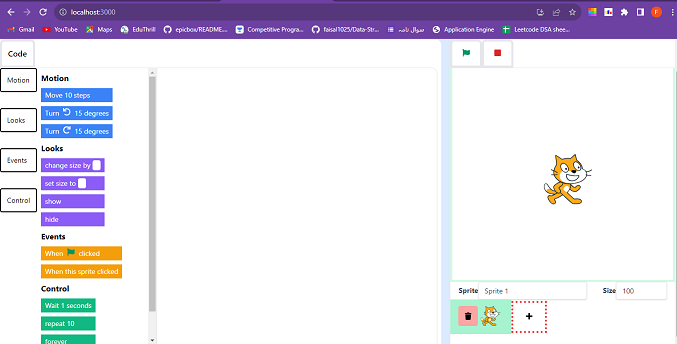
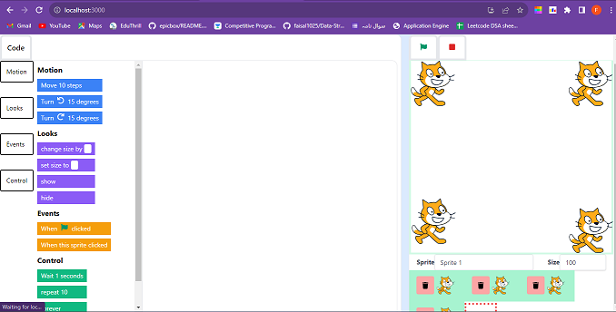
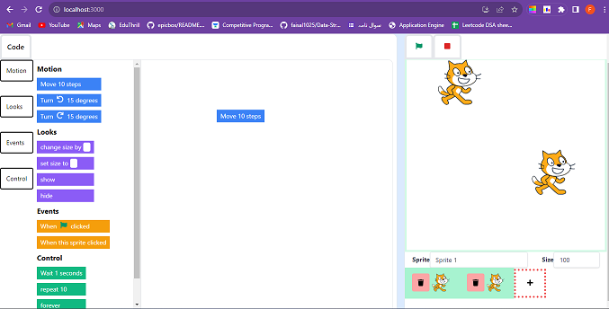

# Scratch clone project

To get started:

- Run `npm i` to install dependencies
- Run `npm start` and open http://localhost:3000 to see the app

# Features implemented

- In the preview section the sprite is movable.

- We can create multiple sprite each sprite can perform it's own actions.

- We can select a sprite by clicking on it.
- Sprite can be deleted along with its actions
- There are four category of actions Events, Control, Looks, Motion.
- Actions can be dragged in the editor area. To run a action click on the action in the editor area.

- All the actions may not implemented. I have implemented some sample actions like that we can implement other actions also.
- Drag the action back to the action menu to delete it.

# Technology Used
- React Js
- Redux-toolkit (for making store and state management)

